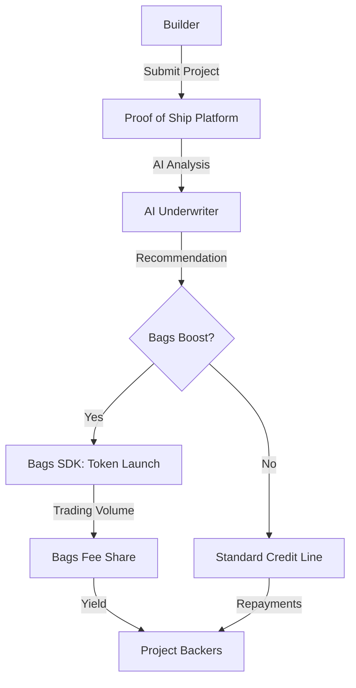

# Proof of Ship — Bags Hackathon Implementation Plan

This document outlines the strategic integration of the **Bags SDK** into the Proof of Ship platform for "The Bags Hackathon". We adhere strictly to our core engineering principles to ensure a performant, maintainable, and high-impact submission.

## Core Principles

- **ENHANCEMENT FIRST**: Enhance existing `SolanaCreditService` and `ServiceManager` rather than creating isolated silos.
- **CONSOLIDATION**: Use `ServiceManager` as the single registry for all agentic and financial services.
- **PREVENT BLOAT**: Only integrate necessary Bags SDK modules (Token Launch & Fee Sharing).
- **DRY**: Shared Solana connection and wallet logic between existing Anchor interactions and Bags SDK.
- **CLEAN**: Explicit separation between Agentic analysis (Circle/Arc) and Creator Finance (Bags/Solana).
- **MODULAR**: Bags integration as a pluggable module within the existing service architecture.
- **PERFORMANT**: Lazy-load Bags SDK only when Solana ecosystem is active.
- **ORGANIZED**: Domain-driven design maintaining clear boundaries between EVM and Solana logic.

---

## Strategy: The "Bags-Powered" Builder Credit

The Proof of Ship platform will leverage Bags to transform builder credit from a debt instrument into a community-backed asset.

### 1. The "Ship" Mechanism (Token Launch)
When a builder requests funding on the Solana ecosystem, the platform will offer an integrated **"Bags Boost"**:
- **Mechanism**: Use `sdk.token.launchV2` to deploy a project-specific token on the Bags launchpad.
- **Collateral**: The project's future milestones act as the "intrinsic value" floor for the token.
- **Liquidity**: The token provides immediate community-driven liquidity while the builder works toward milestones.

### 2. Fee-Sharing Backing
Backers who fund projects on Proof of Ship can earn rewards through Bags' fee-sharing protocol:
- **Mechanism**: Integrate `sdk.feeShare` to distribute protocol fees or a portion of project repayments to holders of the project token or direct backers.
- **Incentive**: Creates a sustainable yield for backers beyond simple loan repayment.

### 3. Agentic Underwriting
Our AI agents (Underwriter, Scout, Verifier) will provide the "Alpha" for the Bags ecosystem:
- **Scout**: Identifies high-potential repos before they launch on Bags.
- **Underwriter**: Analyzes project health to recommend the optimal token launch parameters.
- **Verifier**: Confirms milestones to trigger automated fee distributions or buy-backs.

---

## Implementation Roadmap

### Phase 1: Infrastructure Enhancement
- [ ] Install `@bagsfm/bags-sdk`.
- [ ] Enhance `SolanaCreditService.ts` to include an optional `BagsClient`.
- [ ] Update `ServiceManager.js` to handle Bags service registration and health checks.

### Phase 2: Feature Integration
- [ ] **Bags Boost UI**: Add a toggle in the "Submit Project" flow to "Launch on Bags".
- [ ] **Token Launch Logic**: Implement `launchProjectToken()` in `SolanaCreditService` using the Bags SDK.
- [ ] **Fee Sharing**: Map Proof of Ship backing events to Bags fee-sharing claims.

### Phase 3: Agentic Recommendation
- [ ] Update **Underwriter Agent** to output Bags-specific metrics (e.g., Recommended Initial Purchase, Fee Split).
- [ ] Integrate Bags "Alpha" feed into the **Scout Agent** analysis.

---

## Technical Architecture



## Environment Variables Required
```env
NEXT_PUBLIC_BAGS_API_KEY=...
NEXT_PUBLIC_SOLANA_RPC_URL=...
```
