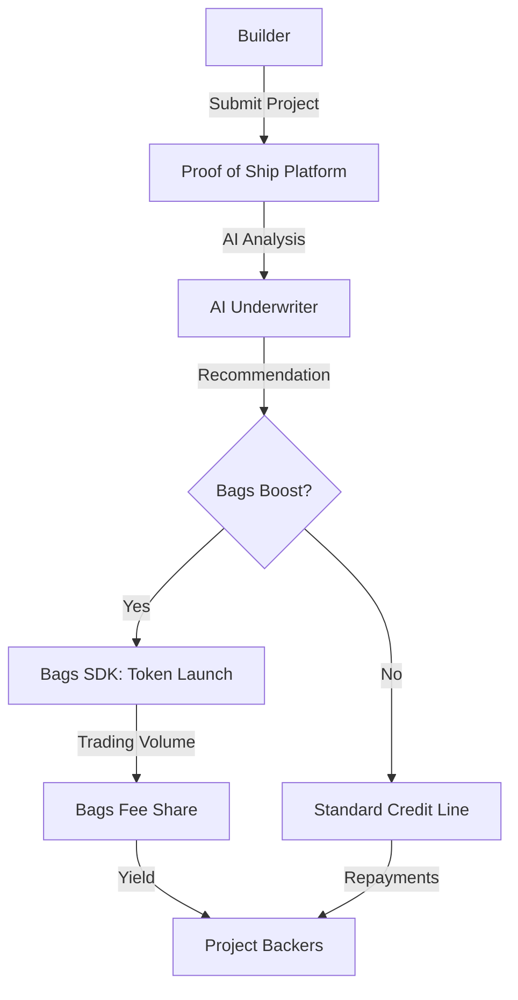

# Proof of Ship — Bags Hackathon Implementation Plan

> Read [VISION.md](./VISION.md) first for the unified capital-stack narrative. This doc is the implementation plan for **Rail 1 (Bags Token)** of that stack.

This document outlines the strategic integration of the **Bags SDK** into the Proof of Ship platform for "The Bags Hackathon". We adhere strictly to our core engineering principles to ensure a performant, maintainable, and high-impact submission.

## Core Principles

- **ENHANCEMENT FIRST**: Enhance existing `SolanaCreditService` and `ServiceManager` rather than creating isolated silos.
- **CONSOLIDATION**: Use `ServiceManager` as the single registry for all agentic and financial services.
- **PREVENT BLOAT**: Only integrate necessary Bags SDK modules (Token Launch & Fee Sharing).
- **DRY**: Shared Solana connection and wallet logic between existing Anchor interactions and Bags SDK.
- **CLEAN**: Explicit separation between Agentic analysis (Circle/Arc) and Creator Finance (Bags/Solana).
- **MODULAR**: Bags integration as a pluggable module within the existing service architecture.
- **ECOSYSTEM-AGNOSTIC, PREFERENCE-AWARE**: Treat every supported chain as a first-class citizen. Surface ecosystem-specific features (e.g. Bags on Solana, x402 on Arc, Linea attestations) tastefully based on signals — connected wallet type, onboarding choice, or recent activity — never by hiding the others.
- **ORGANIZED**: Domain-driven design maintaining clear boundaries between EVM and Solana logic, unified at the UX layer.

---

## Strategy: The "Bags-Powered" Builder Credit

The Proof of Ship platform will leverage Bags to transform builder credit from a debt instrument into a community-backed asset.

### 1. The "Ship" Mechanism (Token Launch)
When a builder requests funding on the Solana ecosystem, the platform will offer an integrated **"Bags Boost"**:
- **Mechanism**: Use `sdk.token.launchV2` to deploy a project-specific token on the Bags launchpad.
- **Collateral**: The project's future milestones act as the "intrinsic value" floor for the token.
- **Liquidity**: The token provides immediate community-driven liquidity while the builder works toward milestones.

### 2. Fee-Sharing Backing
Backers who fund projects on Proof of Ship can earn rewards through Bags' fee-sharing protocol:
- **Mechanism**: Integrate `sdk.feeShare` to distribute protocol fees or a portion of project repayments to holders of the project token or direct backers.
- **Incentive**: Creates a sustainable yield for backers beyond simple loan repayment.

### 3. Agentic Underwriting
Our AI agents (Underwriter, Scout, Verifier) will provide the "Alpha" for the Bags ecosystem:
- **Scout**: Identifies high-potential repos before they launch on Bags.
- **Underwriter**: Analyzes project health to recommend the optimal token launch parameters.
- **Verifier**: Confirms milestones to trigger automated fee distributions or buy-backs.

---

## Ecosystem-Agnostic, Preference-Aware UX

Proof of Ship supports many ecosystems (Arc, Celo, Base, Linea, Arbitrum, Ethereum, Optimism, Solana). We do not hide non-Solana features for the Bags submission — instead we let **the user's expressed preference** shape what gets accentuated.

### Signals we infer preference from
1. **Connected wallet type** — a Phantom/Backpack (Solana) connection biases Solana/Bags surfaces; a MetaMask (EVM) connection biases x402/Linea/Celo surfaces.
2. **Onboarding choice** — first-run wizard asks "Which ecosystems do you build on / care about?" (multi-select, dismissible, editable later).
3. **Recent activity** — projects backed, submitted, or filtered by ecosystem update an implicit weighting.
4. **Manual override** — user can pin a "primary ecosystem" in profile settings.

### How preference shapes the UI (tasteful, not exclusive)
- **Hero / featured rail** reorders ecosystems with the user's primary first.
- **"Submit Project"** flow defaults the chain selector to their primary; Bags Boost CTA is featured for Solana users but still discoverable as a tab/secondary option for everyone.
- **Agent recommendations** lead with the relevant ecosystem path (Bags token params for Solana users, Circle/Arc credit terms for EVM users) but always show the alternative below.
- **Explore filters** remember the last-used ecosystem chips.
- **Empty state copy** speaks the user's language ("Launch your first Bags token" vs "Open your first x402 credit line").

### Anti-patterns (explicitly avoided)
- ❌ Hiding ecosystems the user hasn't picked.
- ❌ Lazy-loading Bags SDK only when "Solana is active" — it loads when a Bags-relevant surface is visible to *any* user.
- ❌ Forcing a chain choice before letting users explore.

---

## Implementation Roadmap

### Phase 1: Infrastructure Enhancement
- [x] Install `@bagsfm/bags-sdk` (1.3.7 in `frontend/package.json`).
- [x] Enhance `SolanaCreditService.ts` to include an optional `BagsClient` (constructor wires it when `NEXT_PUBLIC_BAGS_API_KEY` is set).
- [x] Update `ServiceManager.js` to register the Solana service and surface cluster in health check.
- [x] Scaffold `launchBagsToken()`, `getClaimableFees()`, `claimFees()` on `SolanaCreditService`.
- [x] SNS Identity integration — `.sol` domain names for builders and agents via `SnsService.ts`
- [x] Cloak Private Payments — shielded USDC transfers via `CloakPaymentService.ts`
- [x] QVAC Local-First AI — on-device inference via `QvacService.ts` with cloud fallback
- [ ] Introduce `EcosystemPreferenceContext` (React context) backed by localStorage + Firebase user profile.
- [ ] End-to-end devnet test: launch a token via the SDK and confirm signature on-chain.

### Phase 2: Feature Integration
- [ ] **Bags Boost UI**: Add a "Launch on Bags" path in the "Submit Project" flow, available to all users, defaulted-on for Solana-preferring users.
- [ ] **Token Launch Logic**: Wire `launchBagsToken()` to the submit flow; persist `bagsTokenAddress` on project record.
- [ ] **Fee Sharing**: Map Proof of Ship backing events to Bags fee-sharing claims; surface claimable fees on profile/portfolio.
- [ ] **Wallet-aware preference inference**: Detect connected wallet (Phantom/Backpack vs MetaMask/Rabby) and update preference weights.
- [ ] **Onboarding "Pick your ecosystems" step**: Multi-select, dismissible, editable from profile.

### Phase 3: Agentic Recommendation
- [ ] Update **Underwriter Agent** to output Bags-specific metrics (e.g., Recommended Initial Purchase, Fee Split) alongside existing EVM credit terms.
- [ ] Integrate Bags "Alpha" feed into the **Scout Agent** analysis.
- [ ] Personalize agent output ordering by `EcosystemPreferenceContext`.

### Phase 4: Submission Polish
- [ ] Launch the Proof of Ship project token on Bags (satisfies hackathon token requirement + dogfood).
- [ ] Record 3–5 minute demo video covering the dual-rail story (Bags Boost → x402 credit → milestone verify → fee-share claim).
- [ ] App icon, X handle, GitHub link, and category selection for DoraHacks submission.

---

## Technical Architecture



## Environment Variables Required
```env
NEXT_PUBLIC_BAGS_API_KEY=...
NEXT_PUBLIC_SOLANA_RPC_URL=...
```
